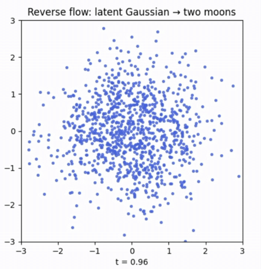
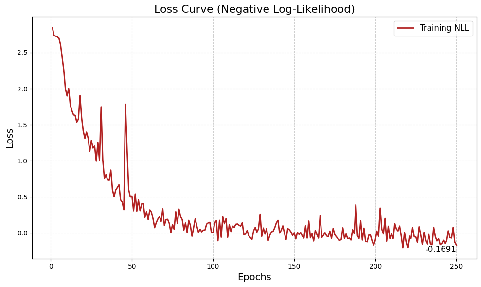

# Beyond Layers: Continuous Normalizing Flows with Neural ODEs

This repository contains the PyTorch implementation for training a **Continuous Normalizing Flow (CNF)** to solve density estimation on the "Two Moons" dataset. It utilizes the [TorchDyn](https://github.com/DiffEqML/torchdyn) library to handle ODE integration and the Adjoint Sensitivity Method.

## Read the Blog Series
This code accompanies my article series **"Beyond Layers"**, where I explain the intuition and mathematics behind Neural ODEs.

* **[Part 1: The Intuition Behind Neural ODEs](https://medium.com/@vaishnavibiradar/beyond-layers-part-1-the-intuition-behind-neural-odes-e944e8eb1c06)** - Moving from discrete layers to continuous dynamics.
* **[Part 2: Implementing Continuous Normalizing Flows](https://medium.com/@vaishnavibiradar/beyond-layers-part-2-neural-ordinary-differential-equations-from-intuition-to-implementation-db23362a1d2b)** - A practical guide to training CNFs for generative modeling.

## Results

### 1. Generative Sampling (Reverse Flow)
Transforming a standard Gaussian distribution ($t=1$) back into the complex Two Moons data distribution ($t=0$) by integrating the learned vector field backward in time.



*(Above: A GIF of the learned flow carrying noise particles to the data manifold)*

### 2. Learned Density
The model successfully learned a continuous probability density function that matches the geometry of the target dataset.

 

 

### 3. Training Convergence
The model minimizes the Negative Log-Likelihood (NLL) effectively over 250 epochs.



---

##  Installation & Usage

1. **Clone the repository**
   ```bash
   git clone https://github.com/vaishnavibiradar/beyond-layers-cnf.git
   cd beyond-layers-cnf
